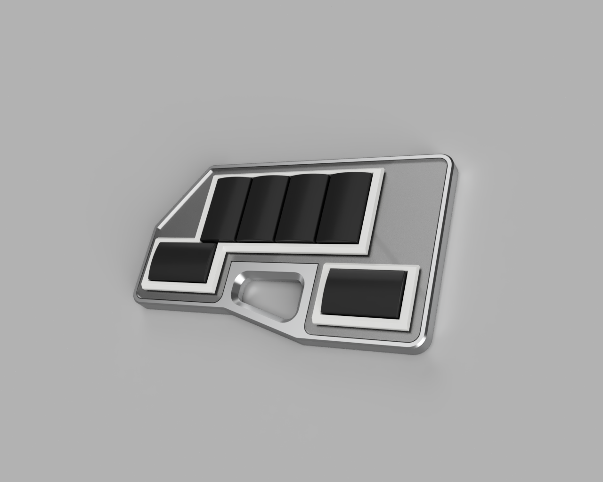

# Falsus Air

## Description
This repository will allow you to build your own controller for In Falsus, with no led and just a few parts to keep the budget tight

## Build guide
### Materials JLC PCB/3DP/CNC
* 6x Buttons : any resin or nylon materials will do, I recommand 8001 transparent for smooth or 3201PA-F Nylon for dark and gritty feeling
* 1x Top plate : 8001 resin transparent (may warp)
* 5x (moq) PCB : thickness 1,6mm, color of your choice
* 1x Case : either CNC milled or 3D printed. If you choose 3D printed go for nylon (may warp) since putting threaded inserts in resin do not work well. For the CNC case you need to add the pdf that indicates the tapped holes. Standard FDM works too.

### Materials Aliexpress
* 6x Plate mounted stabilizers
* 6x Kailh choc v2 series
* 1x raspberry pi pico
* 12x millmax sockets : AS6490-2040B https://fr.aliexpress.com/item/1005009260905480.html
* 11x m2 screws : flat head, 5mm
* 11x m2 threaded inserts : (optionnal if CNC Case) 3mm 50pcs, M2(OD3.2mm) https://fr.aliexpress.com/item/1005003582355741.html
